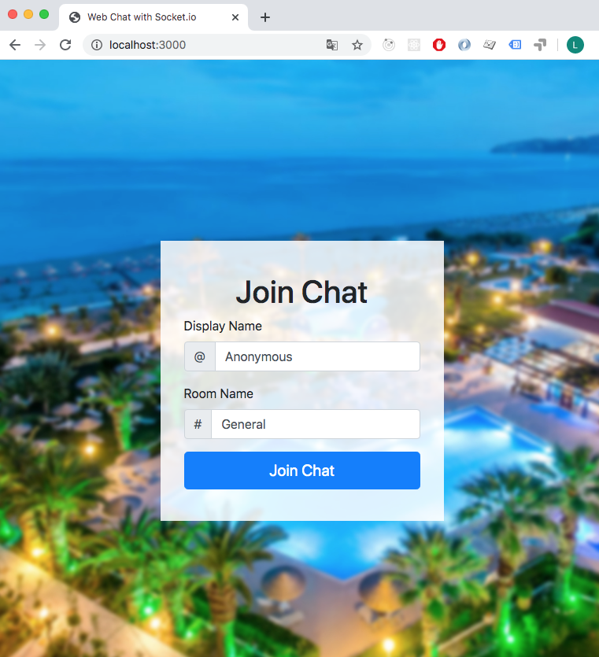
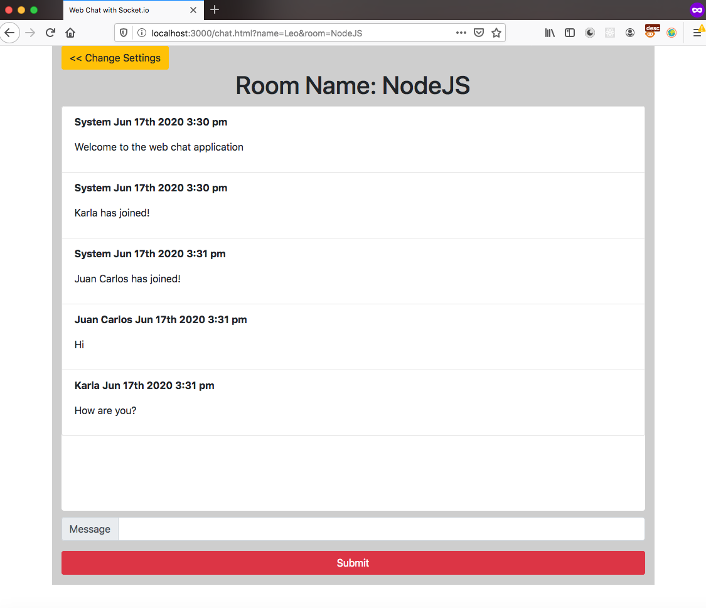

# Web Chat with Socket.io and NodeJS
This project implements Socket.io with express for showing messages in real time.

DEMO: <a href="https://frozen-dusk-08719.herokuapp.com/">Shopping Cart Restaurant</a>

## Join Chat

## Multiples Users with single room
